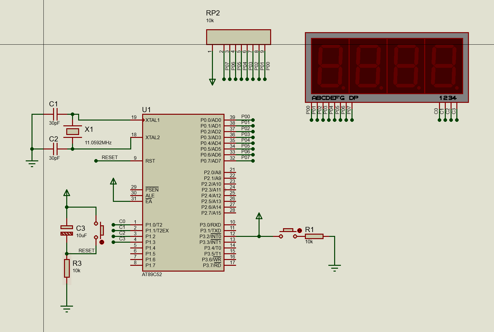
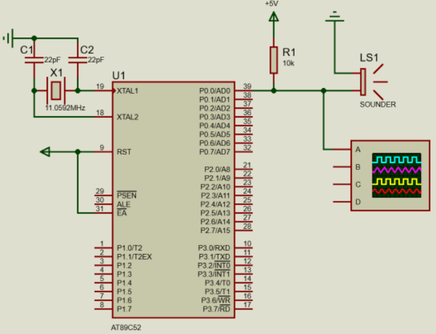

外部中断计数实验硬件部分


外部中断计数实验软件部分
```asm
;***********************功能说明*************************
;用AT89C52的MCU外部中断0记录中断次数并显示
;连线方式为P0口连接数码管段选SA-SH，P32连接按键作为中断输入
;程序启动时，初始化显示一下设定值，有按键按下进入中断，计数+1
;********************************************************
ORG 0000H
AJMP MAIN

ORG 0003H
LJMP INTT0

;--------------------------------------------------------

ORG 0100H
MAIN:	;************主程序******************************
	MOV P1,#0FFH
LOOP:	
	MOV 40H,#00H	;系统初始设置计数初值0000
LOOP0:
	MOV 39H,#00H
	MOV 38H,#00H
	MOV 37H,#02H	
	
	MOV 30H,#00H	;数码管显示缓存，千位
	MOV 29H,#00H	;数码管显示缓存，百位
	MOV 28H,#00H	;数码管显示缓存，十位
	MOV 27H,#00H	;数码管显示缓存，个位
	
	MOV 30H,40H		;初值传递
	MOV 29H,39H
	MOV 28H,38H
	MOV 27H,37H
	
	MOV DPTR,#TAB
	MOV R1,#50H
	MOV R2,#50H
JJJ:				;显示系统设置的初始值
	LCALL DISPLAY	
	DJNZ R1,JJJ 
	;DJNZ R2,JJJ
	
	MOV 30H,#00H	
	MOV 29H,#00H	
	MOV 28H,#00H	
	MOV 27H,#00H	
	SETB EA			;开启CPU中断
	SETB IT0		;边沿触发
	SETB EX0		;开启外部中断0
	
KKK:	
	LCALL DISPLAY	;循化调用显示子程序
	AJMP KKK
	

;***********************功能说明*************************
;*******************外部中断0子程序**********************
;********************************************************
INTT0:
	INC 27H			;累加
	MOV A,27H		;判断个位是否为10，不相等转移，相等进一
	CJNE A,#10,LOOP1
	MOV 27H,#00H
	
	INC 28H			
	MOV A,28H		;判断十位是否为10，不相等转移，相等进一
	CJNE A,#10,LOOP1
	MOV 28H,#00H
	
	INC 29H			
	MOV A,29H		;判断百位是否为10，不相等转移，相等进一
	CJNE A,#10,LOOP1
	MOV 29H,#00H
	
	INC 30H			
	MOV A,30H		;判断千位是否为10，不相等转移，相等清零
	CJNE A,#10,LOOP1
	MOV 30H,#00H
	
LOOP1:
	MOV A,27H		;判断计数值是否达到设定值
	CLR C
	SUBB A,37H
	JNZ LOOP2
	
	MOV A,28H		
	CLR C
	SUBB A,38H
	JNZ LOOP2
	
	MOV A,29H		
	CLR C
	SUBB A,39H
	JNZ LOOP2
	
	MOV A,30H		
	CLR C
	SUBB A,40H
	JNZ LOOP2
	
	MOV P0,#0FFH		;计数值是否达到设定值，清零
	MOV 30H,#00H		
	MOV 29H,#00H	
	MOV 28H,#00H	
	MOV 27H,#00H
	MOV P1,#0FFH
	
LOOP2:
	RETI
	
;***********************功能说明*************************
;**********************显示子程序************************
;********************************************************
DISPLAY:
	;MOV P1,#0FFH
	
	MOV A,30H			;数码管显示千位数
	MOVC A,@A+DPTR
	MOV P0,A
	SETB P1.0
	ACALL DELAY
	CLR P1.0
	
	MOV A,29H			;数码管显示百位数
	MOVC A,@A+DPTR
	MOV P0,A
	SETB P1.1
	ACALL DELAY
	CLR P1.1
	
	MOV A,28H			;数码管显示十位数
	MOVC A,@A+DPTR
	MOV P0,A
	SETB P1.2
	ACALL DELAY
	CLR P1.2
	
	MOV A,27H			;数码管显示个位数
	MOVC A,@A+DPTR
	MOV P0,A
	SETB P1.3
	ACALL DELAY
	CLR P1.3
	
	
	RET
	
;=========================================
TAB:					;数码管显示数字需要传入的值
	DB	0C0H;0
	DB	0F9H;1
	DB	0A4H;2
	DB	0B0H;3
	DB	099H;4
	DB	092H;5
	DB	082H;6
	DB	0F8H;7
	DB	080H;8
	DB	090H;9
;=========================================
DELAY:					;延时函数
		MOV R6,#10H
DEL1:
		MOV R7,#10H
		DJNZ R7,$
		DJNZ R6,DEL1
		RET
;=========================================

END
```

蜂鸣器实验硬件部分


蜂鸣器实验软件部分
```asm
PP EQU P0.0
ORG 0000H
LJMP START
ORG 000BH
INC 20H ;中断服务,中断计数器加 1
MOV TH0,#0D8H
MOV TL0,#0EFH ;12M 晶振，形成 10 毫秒中断
RETI
ORG 0100H
START: 
MOV SP,#50H ;SP：堆栈指针寄存器
MOV TH0,#0D8H
MOV TL0,#0EFH
MOV TMOD,#01H ;定时器 0 工作方式 1
MOV IE,#82H ;开总中断和定时器 0 中断
MUSIC0:
NOP
MOV DPTR,#DAT ;表头地址送 DPTR
MOV 20H,#00H ;中断计数器清 0
MUSIC1:
NOP
CLR A ;A;清零
MOVC A,@A+DPTR ;查表取代码
JZ END0 ;是 00H,则结束
CJNE A,#0FFH,MUSIC5 ;如果是休止符，往下执行
LJMP MUSIC3
MUSIC5:
NOP
MOV R6,A ;R6=18H 音符的频率
INC DPTR ;DPTR;加 1
MOV A,#0
MOVC A,@A+DPTR ;取节拍代码送 R7
MOV R7,A ;R7=30H 音符发音的时间
SETB TR0 ;启动计数
MUSIC2:
NOP
CPL PP ;音乐输出口控制
MOV A,R6
MOV R3,A ;R3=R6=18H
LCALL DEL
MOV A,R7
CJNE A,20H,MUSIC2 ;中断计数器(20H)=R7 否?
 ;不等,则继续循环
MOV 20H,#00H ;等于,则取下一代码
INC DPTR
LJMP MUSIC1
MUSIC3:
NOP ;休止 100 毫秒
CLR TR0 
MOV R2,#0DH ;R2=13
MUSIC4:
NOP
MOV R3,#0FFH ;R3=255
LCALL DEL
DJNZ R2,MUSIC4
INC DPTR
LJMP MUSIC1
END0:
NOP
MOV R2,#0FFH ;歌曲结束,延时 1 秒后继续
MUSIC6:
MOV R3,#00H
LCALL DEL
DJNZ R2,MUSIC6
LJMP MUSIC0
DEL:
NOP
DEL3: 
MOV R4,#02H
DEL4: 
NOP
DJNZ R4,DEL4
NOP
DJNZ R3,DEL3
RET
NOP
;音律编码，作用于定时时间
DAT:
DB 30H,20H,2BH,10H,26H,10H
DB 26H,20H,26H,20H,2BH,20H,30H,10H,2BH,10H,2BH,60H,30H,10H,2BH,10H
DB 26H,20H,26H,20H,2BH,20H,30H,20H,30H,60H,40H,10H,39H,10H
DB 40H,40H,40H,10H,40H,10H,39H,10H,30H,10H,30H,60H,30H,20H
DB 30H,20H,30H,20H,30H,10H,2BH,10H,2BH,40H,30H,20H,2BH,10H,26H,10H
DB 26H,20H,26H,20H,20H,20H,1CH,10H,2BH,10H,2BH,40H,26H,20H,2BH,10H,30H,10H
DB 30H,20H,30H,20H,2BH,20H,26H,10H,20H,10H,20H,60H,40H,10H,40H,10H
DB 39H,20H,30H,10H,30H,10H,30H,10H,26H,30H,2BH,20H,30H,20H,30H,20H,2BH,10H,30H,10H
DB 30H,0C0H,26H,20H,26H,10H,20H,10H
DB 20H,20H,20H,10H,20H,10H,20H,20H,20H,10H,1CH,10H,1CH,40H,26H,20H,2BH,20H
DB 30H,20H,30H,20H,30H,20H,2BH,10H,26H,10H,26H,60H,26H,10H,20H,10H
DB 20H,20H,20H,20H,20H,20H,1CH,10H,18H,10H,18H,20H,1CH,20H,20H,20H,26H,20H
DB 2BH,20H,30H,20H,30H,20H,39H,10H,2BH,10H,2BH,60H,26H,10H,20H,10H
DB 20H,20H,20H,20H,20H,10H,1CH,20H,20H,10H,1CH,40H,26H,20H,2BH,20H
DB 30H,20H,30H,20H,30H,20H,2BH,10H,26H,10H,26H,60H,26H,10H,20H,10H
DB 20H,20H,20H,20H,20H,20H,1CH,10H,18H,10H,18H,20H,1CH,20H,20H,20H,26H,10H,2BH,10H
DB 2BH,20H,2BH,20H,2BH,80H,30H,10H,26H,20H,24H,10H
DB 26H,20H,2BH,20H,2BH,80H,26H,20H,2BH,10H,30H,10H
DB 30H,40H,26H,20H,2BH,10H,30H,10H,30H,40H,26H,20H,2BH,20H
DB 26H,20H,30H,20H,26H,20H,1CH,10H,20H,10H,20H,60H,26H,10H,20H,10H
DB 1CH,20H,1CH,10H,20H,10H,20H,20H,1CH,10H,20H,10H,20H,40H,26H,10H,2BH,10H,30H,20H
DB 2BH,20H,2BH,10H,26H,10H,2BH,20H,30H,10H,2BH,10H,2BH,40H,26H,20H,2BH,10H,30H,10H
DB 30H,40H,26H,20H,2BH,10H,30H,10H,30H,40H,26H,20H,2BH,20H
DB 26H,20H,30H,20H,26H,10H,1CH,20H,20H,10H,20H,60H,26H,10H,20H,10H
DB 1CH,20H,1CH,20H,18H,20H,20H,10H,1CH,10H,20H,30H,20H,10H,26H,10H,2BH,10H,30H,20H
DB 2BH,40H,2BH,10H,30H,10H,2BH,10H,26H,10H,2BH,40H,26H,20H,26H,20H,2BH,60H,30H,20H,30H,0C0H
DB 00H
END
```

遇到的问题与解决方法：
* proteus仿真时蜂鸣器正常工作，但是实际电路测试中蜂鸣器的声音怪怪的