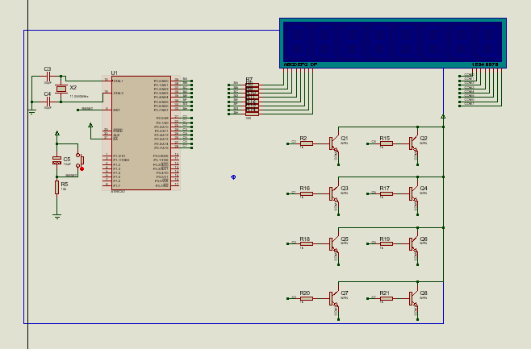
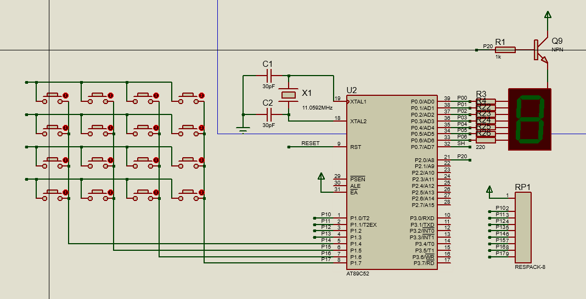

数码管显示实验硬件部分


数码管显示实验软件部分
```asm
PP EQU P0.0
ORG 0000H
LJMP START

ORG 000BH
LJMP T0INT

ORG 0100H
START: 
	MOV TH0,#0D8H
	MOV TL0,#0F0H	;10ms
	MOV TMOD,#01H ;定时器 0 工作方式 1
	MOV 30H,#01H	;数码管位选
	MOV 31H,#00H	;数码管索引
	SETB EA
	SETB ET0
	SETB TR0
MAIN:
AJMP MAIN


T0INT:	;定时器 0中断 工作方式 1
	MOV TH0,#0D8H	;重设定时器初值
	MOV TL0,#0F0H ;12M 晶振，形成 10 毫秒中断
	MOV P2,#0X00	;停止位选更改数据
	MOV A,31H
	MOV DPTR,#DAT
	MOVC A,@A+DPTR
	MOV P0,A
	MOV P2,30H	;开启位选
	MOV A,30H	;位选右移
	RL A
	MOV 30H,A	
	INC 31H ;索引+1
	ANL 31H,#07H
	SETB TR0	;开启终中断
	RETI

DAT:	;数码管数字数据存贮
	DB	0F9H;1
	DB	0A4H;2
	DB	0B0H;3
	DB	099H;4
	DB	092H;5
	DB	082H;6
	DB	0F8H;7
	DB	080H;8
	DB	090H;9
	DB	0C0H;0

END
```

键盘的应用实验硬件部分


键盘的应用实验软件部分
```c
#include <reg52.h>
#include <intrins.h>

#define uchar unsigned char
#define uint unsigned int

#define PSEG P0
#define PKEY P1

sbit C0 = P2^0;

void delayms(uint);
uchar scan(void);

uchar code seg[]=
{0xc0,0xf9,0xa4,0xb0,0x99,0x92,0x82,0xf8,0x80,0x90,0x88,0x83,0xc6,0xa1,0x86,0x8c};//数码管数字数据存贮

void main(void)
{
	uchar key;
	C0 = 1;
	while(1)
	{
		key = scan();//扫描
		if(key!=16)
		PSEG = seg[key];
	}
}	

void delayms(uint j)//延时
{
	uchar i;
	for(;j>0;j--)
	{
		i=250;
		while(--i);
		i=249;
		while(--i);
	}
}

uchar scan(void)
{
	uchar k=16,m,n,in;
	PKEY = 0xf0;
	if((PKEY&0xf0)!=0xf0)//判断行按键是否被按下
	{
		for(m=0;m<4;m++)
		{
			PKEY=~(0x01<<m);//依次取反确定是哪一行
			for(n=0;n<4;n++)
			{
				in = PKEY;
				in = in>>(4+n);
				if((in&0x01)==0)//确定是哪一列被按下
				{
					delayms(10);
					if((in&0x01)==0){k=n+m*4;break;}
				}
			}
			if(k!=16){break;}
		}
	}
return(k);
}
```

遇到的问题与解决方法：
* 数码管显示实验延时设定为10ms还是会有点闪
* 键盘的应用实验用汇编语言工作量有点大，就用C语言来写了